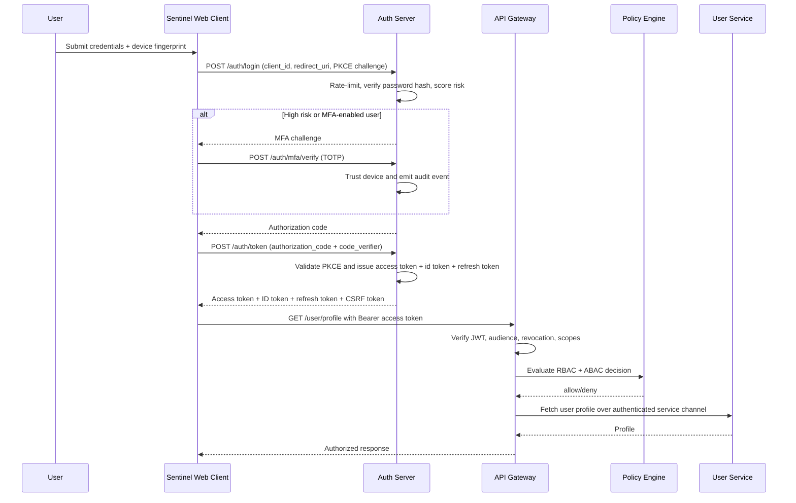
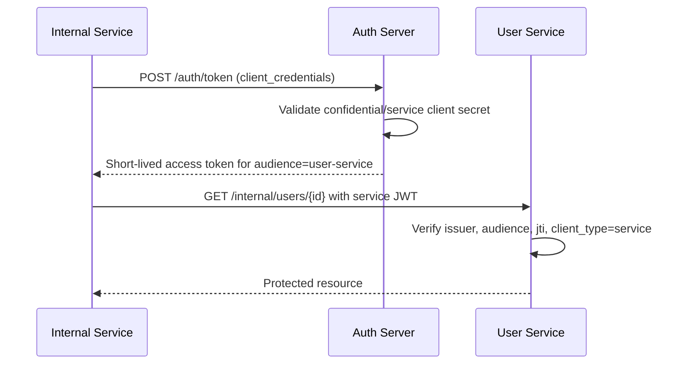
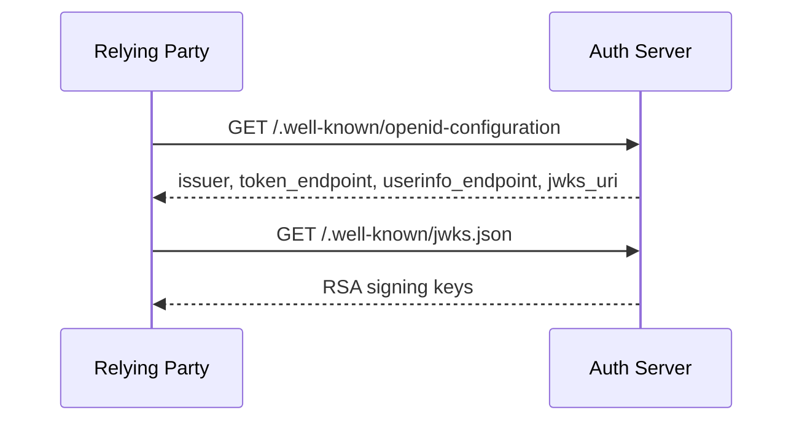

# OAuth2 Flow Diagrams

## Authorization Code + PKCE

```mermaid
sequenceDiagram
    participant User
    participant Client as Sentinel Web Client
    participant Auth as Auth Server
    participant Gateway as API Gateway
    participant Policy as Policy Engine
    participant UserSvc as User Service

    User->>Client: Submit credentials + device fingerprint
    Client->>Auth: POST /auth/login (client_id, redirect_uri, PKCE challenge)
    Auth->>Auth: Rate-limit, verify password hash, score risk
    alt High risk or MFA-enabled user
        Auth-->>Client: MFA challenge
        Client->>Auth: POST /auth/mfa/verify (TOTP)
        Auth->>Auth: Trust device and emit audit event
    end
    Auth-->>Client: Authorization code
    Client->>Auth: POST /auth/token (authorization_code + code_verifier)
    Auth->>Auth: Validate PKCE and issue access token + id token + refresh token
    Auth-->>Client: Access token + ID token + refresh token + CSRF token
    Client->>Gateway: GET /user/profile with Bearer access token
    Gateway->>Gateway: Verify JWT, audience, revocation, scopes
    Gateway->>Policy: Evaluate RBAC + ABAC decision
    Policy-->>Gateway: allow/deny
    Gateway->>UserSvc: Fetch user profile over authenticated service channel
    UserSvc-->>Gateway: Profile
    Gateway-->>Client: Authorized response
```

## Client Credentials

```mermaid
sequenceDiagram
    participant Service as Internal Service
    participant Auth as Auth Server
    participant UserSvc as User Service

    Service->>Auth: POST /auth/token (client_credentials)
    Auth->>Auth: Validate confidential/service client secret
    Auth-->>Service: Short-lived access token for audience=user-service
    Service->>UserSvc: GET /internal/users/{id} with service JWT
    UserSvc->>UserSvc: Verify issuer, audience, jti, client_type=service
    UserSvc-->>Service: Protected resource
```

## OIDC Discovery

```mermaid
sequenceDiagram
    participant RP as Relying Party
    participant Auth as Auth Server

    RP->>Auth: GET /.well-known/openid-configuration
    Auth-->>RP: issuer, token_endpoint, userinfo_endpoint, jwks_uri
    RP->>Auth: GET /.well-known/jwks.json
    Auth-->>RP: RSA signing keys
```
